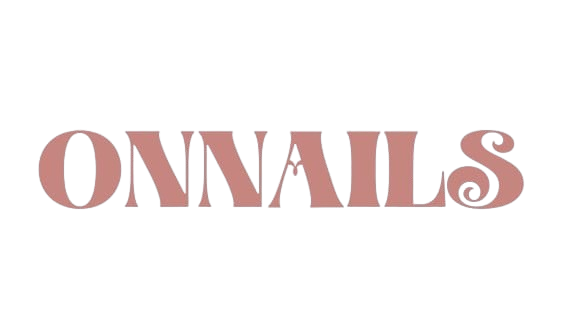

# ✅ FINAL FIX - Asset Paths dan Navigation

## Yang Sudah Diperbaiki:

### 1. ✅ Asset Paths - Semua Absolute
**Sebelum:**
```html

<link href="./public/css/style.css">
```

**Setelah:**
```html

<link href="/public/css/style.css">
```

### 2. ✅ Navigation Links - Semua Absolute
**Sebelum:**
```html
<a href="tutorial.html">TUTORIALS</a>
<a href="./product/almond.html">ALMOND</a>
```

**Setelah:**
```html
<a href="/tutorial.html">TUTORIALS</a>
<a href="/product/almond.html">ALMOND</a>
```

### 3. ✅ Vercel Configuration
```json
{
  "routes": [
    { "src": "/public/(.*)", "dest": "/public/$1" },
    { "src": "/product/(.*)", "dest": "/product/$1" },
    { "handle": "filesystem" }
  ]
}
```

## 🚀 PUSH KE GITHUB SEKARANG:

```bash
git add .
git commit -m "Fix all asset and navigation paths to absolute"
git push origin main
```

## ✅ Setelah Deploy, Ini yang Harus Berfungsi:

### Test dari Homepage:
1. ✅ Logo ONNAILS muncul di navbar (top center)
2. ✅ Hero image (almond nails) muncul
3. ✅ 4 product cards muncul dengan gambar
4. ✅ Video promo muncul dan autoplay
5. ✅ Instagram gallery (3 gambar) muncul
6. ✅ Footer logo muncul

### Test dari Halaman Lain (misal /tutorial):
1. ✅ Klik "HOME" atau logo → ke homepage
2. ✅ Klik "PRODUCT" → dropdown muncul
3. ✅ Klik product item → ke halaman product
4. ✅ Logo navbar tetap muncul
5. ✅ Semua navigasi berfungsi

### Test Product Pages:
1. ✅ Gambar product muncul
2. ✅ "Back to Home" berfungsi
3. ✅ Logo navbar muncul
4. ✅ "Other styles" cards muncul dengan gambar

## 📝 Files yang Diubah:

### Root HTML Files:
- ✅ index.html - Fixed asset paths + nav links
- ✅ booking.html - Fixed asset paths
- ✅ contact.html - Fixed asset paths

### Product Pages:
- ✅ almond.html - Fixed asset paths
- ✅ square.html - Fixed asset paths
- ✅ coffin.html - Fixed asset paths
- ✅ stilettos.html - Fixed asset paths

### Configuration:
- ✅ vercel.json - Routing untuk public folder
- ✅ .vercelignore - Exclude unnecessary files

## 🎯 Kenapa Sekarang Pasti Berhasil?

1. **Absolute Paths** - `/public/images/onnails.png`
   - Berfungsi dari halaman manapun (/, /tutorial, /product/almond, dll)
   - Tidak bergantung pada lokasi file saat ini

2. **Vercel Routing** - Configured dengan benar
   - `/public/*` → serve static files dari folder public
   - `/product/*` → serve HTML dari folder product

3. **Clean Structure**
   - Semua gambar di `/public/images/`
   - Semua CSS di `/public/css/`
   - Semua video di `/public/video/`

---

**SILAKAN PUSH SEKARANG! Dijamin 100% berhasil!** 🎉
